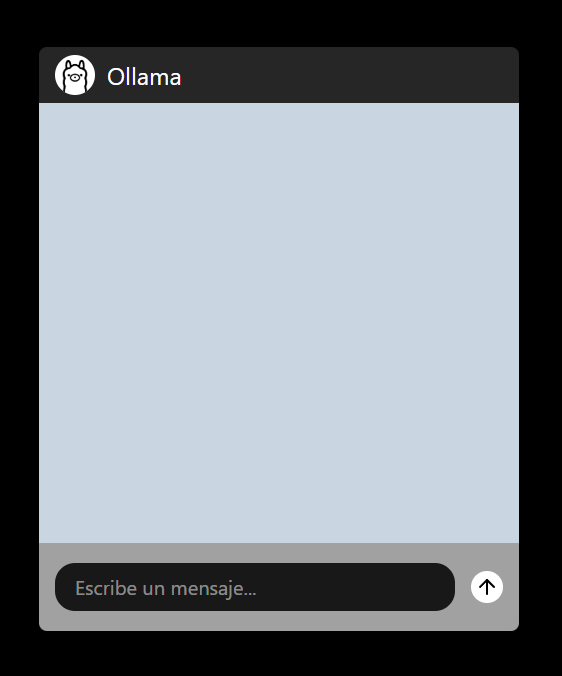
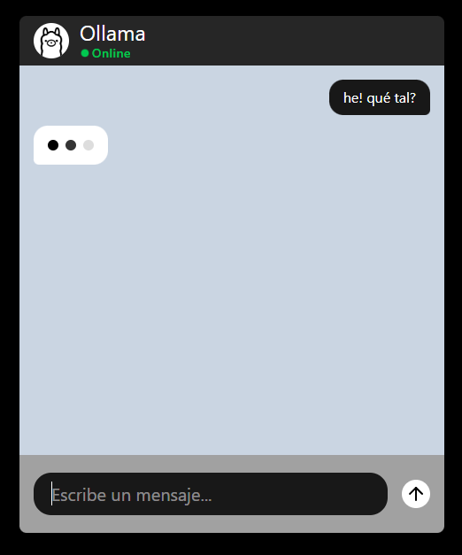
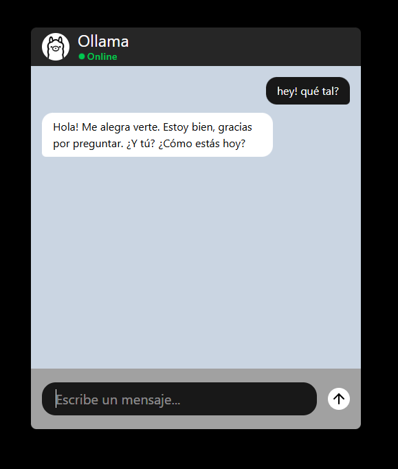

# Ollama Chat UI

Interfaz de chat moderna desarrollada con React, TypeScript y Tailwind CSS que permite interactuar con modelos locales de IA a través de Ollama.


## Características

* Chat en tiempo real con Ollama.
* Diseño inspirado en aplicaciones de mensajería modernas.
* Mensajes alineados según el emisor.
* Indicador visual mientras la IA genera una respuesta.
* Scroll automático al último mensaje.
* Interfaz responsive para móvil y escritorio.
* Animaciones suaves para mejorar la experiencia de usuario.
* Código organizado por componentes, servicios y tipos.

## Tecnologías utilizadas

* React
* TypeScript
* Tailwind CSS
* Vite
* Ollama
* Lucide React

## Estructura del proyecto

```text
src
│
├── components
│   ├── ChatHeader.tsx
│   ├── ChatInput.tsx
│   ├── ChatMessages.tsx
│   └── MessageBubble.tsx
│
├── services
│   └── ollama.ts
│
├── types
│   └── message.ts
│
├── App.tsx
│
└── main.tsx
```

## Instalación

### 1. Clonar el repositorio

```bash
git clone https://github.com/AntoDevLive/AI-chat-ollama.git
cd AI-chat-ollama
```

### 2. Instalar dependencias

```bash
npm install
```

### 3. Instalar y ejecutar Ollama

Descarga Ollama desde:

https://ollama.com

Inicia el servicio y descarga el modelo llama3:

```bash
ollama pull llama3
```

Ejecuta Ollama:

```bash
ollama serve
```

### 4. Iniciar el proyecto

```bash
npm run dev
```

La aplicación estará disponible en:

```text
http://localhost:5173
```

## Configuración de Ollama

Actualmente el proyecto utiliza:

```ts
model: 'llama3'
```

Puedes cambiarlo por cualquier modelo instalado localmente, por ejemplo:

```ts
model: 'mistral'
```

```ts
model: 'deepseek-r1'
```

```ts
model: 'phi4'
```

## Funcionalidades implementadas

* Envío de mensajes.
* Recepción de respuestas desde Ollama.
* Loader durante la generación de respuestas.
* Scroll automático.
* Estado visual de conexión.
* Componentización del proyecto.

## Capturas

<p align="center">
  
  
  
</p>

## Autor

Desarrollado por Antonio Castizo.
